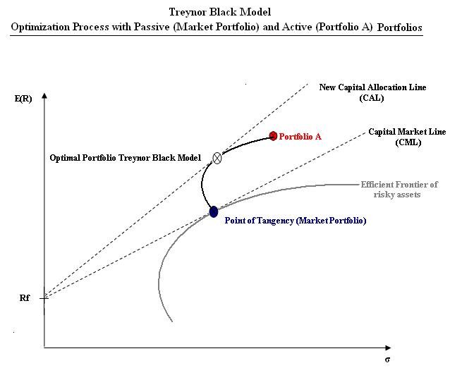
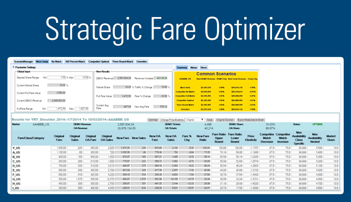
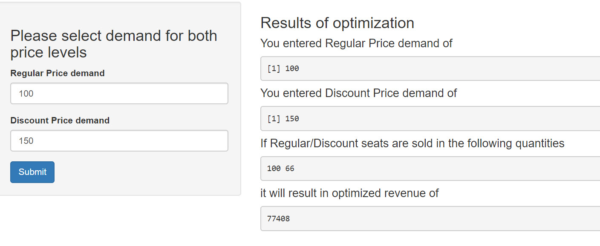
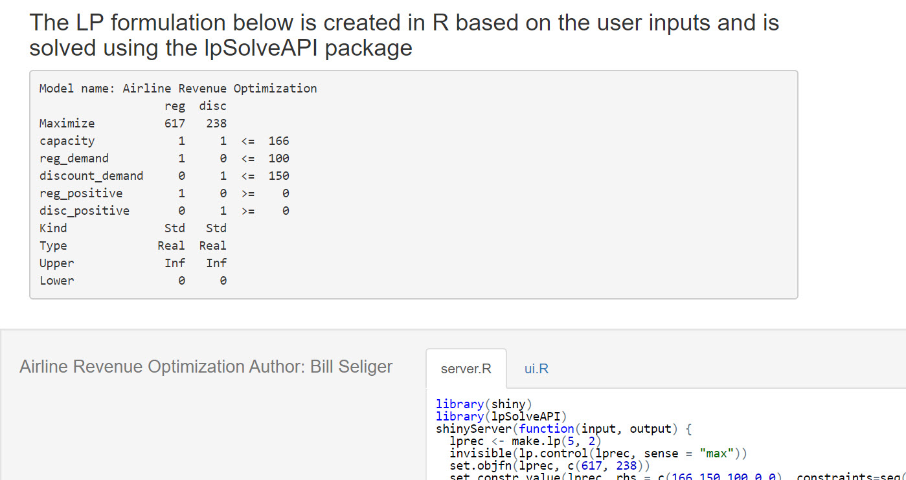

SatRday_Optimization
========================================================
author: Bill Seliger

Slides & code on Github https://github.com/BillSeliger  

LinkedIn https://www.linkedin.com/in/billseliger/  

Twitter @BillSeliger   

April 27, 2019  

Motivation
========================================================

- What is Optimization
- Types of Optimization (LP, IP, MILP, etc.)
- Where is Optimization encountered
- How to approach Optimization in R
- Constructing and solving an optimization problem in R
- Suggested packages and solvers 
- Additional resources
- Q & A


What is Optimization
========================================================
"In mathematics, computer science and operations research, mathematical optimization (alternatively spelled optimisation) or mathematical programming is the selection of a best element (with regard to some criterion) from some set of available alternatives.

What is Optimization (continued)
========================================================
In the simplest case, an optimization problem consists of maximizing or minimizing a real function by systematically choosing input values from within an allowed set and computing the value of the function. The generalization of optimization theory and techniques to other formulations constitutes a large area of applied mathematics. More generally, optimization includes finding "best available" values of some objective function given a defined domain (or input), including a variety of different types of objective functions and different types of domains."   - Wikipedia


Types of Optimization
========================================================

- LP - Linear Pogramming
- IP - Integer Programming
- MILP - Mixed Integer Linear Programming
- An area rich in research, some of the most computationally intensive problems known
- Many MILP problems cannot be proven 'solved' - typical to approximate optimal


Where is Optimization encountered?
========================================================



Where is Optimization encountered?
========================================================


Where is Optimization encountered?
========================================================


Where is Optimization encountered?
========================================================

- Finance
  - Portfolio optimization
- Pricing Optimzation
  - Baskets of goods and revenue/profit optimization
- Operations Research, Logistics, Supply Chain
  - Assignment problems
  - Multi-level Inventory Optimization
  - Travelling salesperson problems
  - Transshipment and Routing problems

This will be easy for you!
========================================================


This will be easy for you!
========================================================


How to approach in R - build a matrix
========================================================


```r
require(lpSolveAPI)

lprec <- make.lp(3, 4)
```


Populate the matrix
========================================================


```r
set.column(lprec, 1, c(0.0, 0.24, 12.68))
set.column(lprec, 2, 78.26, indices = 1)
set.column(lprec, 3, c(11.31, 0.08), indices = 2:3)
set.column(lprec, 4, c(2.9, 0.9), indices = c(1, 3))
```


Elements of Optimization
========================================================

Objective Function

Decision Variables

Constraints


Solving an Integer Problem - Setup Matrix
========================================================


```r
require(lpSolveAPI)

## test1 - 4 orders, 5 plants
## create the model - constraints first arg, decision variables 2nd arg
## constraints are 0 as we will add them below
test1 <- make.lp(0, 20)
## set the objective function
set.objfn(test1, c(99, 98, 97, 96, 
                   89, 88, 87, 86,
                   79, 78, 77, 76,
                   74, 68, 67, 66,
                   59, 58, 57, 50))
```

Solving an Integer Problem - Add Constraints
========================================================


```r
## add supply must meet demand constraints
add.constraint(test1, c(1, 0, 0, 0, 1, 0, 0, 0, 1, 0, 0, 0, 1, 0, 0, 0, 1, 0, 0, 0), "=", 10)
add.constraint(test1, c(0, 1, 0, 0, 0, 1, 0, 0, 0, 1, 0, 0, 0, 1, 0, 0, 0, 1, 0, 0), "=", 16)
add.constraint(test1, c(0, 0, 1, 0, 0, 0, 1, 0, 0, 0, 1, 0, 0, 0, 1, 0, 0, 0, 1, 0), "=", 23)
add.constraint(test1, c(0, 0, 0, 1, 0, 0, 0, 1, 0, 0, 0, 1, 0, 0, 0, 1, 0, 0, 0, 1), "=", 31)
## add demand must not exceed supply constraints
add.constraint(test1, c(1, 1, 1, 1, 0, 0, 0, 0, 0, 0, 0, 0, 0, 0, 0, 0, 0, 0, 0, 0), "<=", 40)
add.constraint(test1, c(0, 0, 0, 0, 1, 1, 1, 1, 0, 0, 0, 0, 0, 0, 0, 0, 0, 0, 0, 0), "<=", 40)
add.constraint(test1, c(0, 0, 0, 0, 0, 0, 0, 0, 1, 1, 1, 1, 0, 0, 0, 0, 0, 0, 0, 0), "<=", 40)
add.constraint(test1, c(0, 0, 0, 0, 0, 0, 0, 0, 0, 0, 0, 0, 1, 1, 1, 1, 0, 0, 0, 0), "<=", 40)
add.constraint(test1, c(0, 0, 0, 0, 0, 0, 0, 0, 0, 0, 0, 0, 0, 0, 0, 0, 1, 1, 1, 1), "<=", 40)
```

Solving an Integer Problem - Set Decision Variables
========================================================


```r
## set constraint type
set.type(test1, c(1:20), "integer")
## name the variables - this isn't necessary but is done for readability here
dimnames(test1) <- list(c("order1demand", "order2demand", "order3demand", "order4demand","capacityplant1", "capacityplant2", "capacityplant3","capacityplant4", "capacityplant5"), c("plant1order1", "plant1order2", "plant1order3", "plant1order4","plant2order1", "plant2order2", "plant2order3", "plant2order4", "plant3order1", "plant3order2", "plant3order3", "plant3order4","plant4order1", "plant4order2", "plant4order3", "plant4order4",
"plant5order1", "plant5order2", "plant5order3", "plant5order4"))
```


Solving an Integer Problem - Solve it!
========================================================


```r
## solve the model, a [0] indicates a solution was found
solve(test1)
```

```
[1] 0
```

```r
## get the objective
get.objective(test1)
```

```
[1] 4784
```

Solving an Integer Problem - Solve it!
========================================================


```r
## get the decision variables
get.variables(test1)
```

```
 [1]  0  0  0  0  0  0  0  0  0  0  0  0  1 16 23  0  9  0  0 31
```

```r
## make a matrix of the decision variables
results1 <- get.variables(test1)
results1 <- matrix(unlist(results1), nrow = 5, ncol = 4, byrow = TRUE)
## name the rows and columns
rownames(results1) <- c("plant1","plant2", "plant3", "plant4", "plant5")
colnames(results1) <- c("order1","order2", "order3", "order4")
```


Solving an Integer Problem - Solve it!
========================================================


```
       order1 order2 order3 order4
plant1      0      0      0      0
plant2      0      0      0      0
plant3      0      0      0      0
plant4      1     16     23      0
plant5      9      0      0     31
```


Shiny can be a frontend
========================================================



Shiny can be a frontend
========================================================



Suggested Packages and Resources
========================================================

lpSolveAPI

https://cran.r-project.org/web/views/Optimization.html

billseliger.com/test4

https://github.com/BillSeliger/SatRdayOptimization

https://github.com/BillSeliger/NUAnalytics


Open Source & Commercial optimizers
========================================================


Thank you!
========================================================

Q & A

